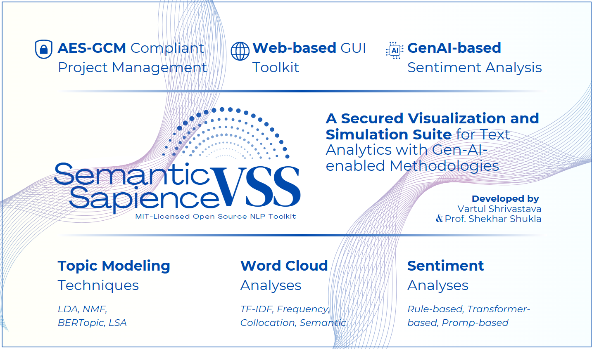

## Features
- Implements **AES-GCM encryption** to secure project files with customizable session keys.  
- Supports multiple **word cloud analysis** methods, including **TF-IDF-based, frequency-based, collocation-based, and semantic word clouds** using embeddings.  
- Provides **topic modeling techniques** such as **Latent Dirichlet Allocation (LDA), Non-Negative Matrix Factorization (NMF), Latent Semantic Analysis (LSA), and BERTopic** for uncovering themes.  
- Includes **rule-based sentiment analysis (VADER, TextBlob), transformer-based sentiment analysis,** and **Gen-AI-powered methodologies** like **LLM-driven ABSA and Zero-Shot Sentiment Analysis**.  
- Features a **modular floating interface** for multiple simultaneous text analysis workflows.  
- Offers a **checkpoint system** for saving, restoring, and comparing different analysis configurations.  
- Supports **local execution of Gen-AI models through Ollama** for efficient NLP tasks.

---

## Installation

### Essential Prerequisites
- Python **3.12.3** or above
- Ollama **0.3.3** or above
- Flask **3.0.3** or above
- Install dependencies given in requirements.txt

### Setup Instructions
```sh
# Clone the repository
git clone https://github.com/vartul-shrivastava/Semantic-Sapience-VSS-29012025.git
cd app

# Install dependencies
pip install -r requirements.txt

# Ensure Ollama is running
ollama list

# Start the application
python app.py
```

## API Endpoints

| Endpoint                          | Method | Description                          |
|-----------------------------------|-------:|--------------------------------------|
| `/upload`                         |  POST  | Upload dataset (CSV/XLSX)            |
| `/process/wordcloud`             |  POST  | Generate word clouds                 |
| `/process/topic_modeling`         |  POST  | Extract topics from text             |
| `/process/sentiment`             |  POST  | Perform sentiment analysis           |
| `/process/absa`                  |  POST  | LLM-based Aspect-Based Sentiment Analysis      |
| `/process/zero_shot_sentiment`   |  POST  | Zero-Shot Sentiment Analysis         |

---

## License
**MIT License**  
This project is open-source and available under the MIT License.

